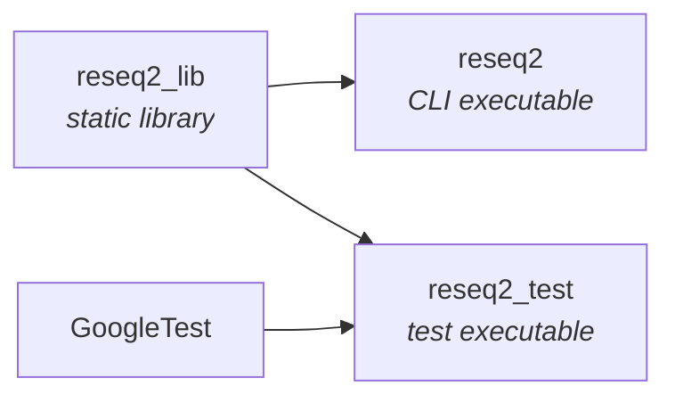
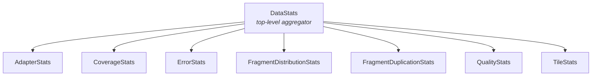

# Architecture

ReSeq2 learns error and quality profiles from real Illumina paired-end sequencing data, then uses those profiles to simulate realistic reads. This page describes the internal structure of the codebase.

## Build Targets

The CMake build produces one static library and two executables:



- **`reseq2_lib`** --- Static library containing all production source code.
- **`reseq2`** --- Thin CLI executable that links `reseq2_lib` and dispatches to commands.
- **`reseq2_test`** --- Test executable linking `reseq2_lib` and GoogleTest.

## Commands

The entry point is `reseq/main.cpp`, which parses the sub-command and delegates:

| Command | Purpose |
|---|---|
| `illuminaPE` | Full pipeline: collect stats from BAM, estimate probabilities via IPF, simulate reads |
| `seqToIllumina` | Apply Illumina error/quality model to input sequences (no coverage model) |
| `queryProfile` | Extract summary info from `.reseq` stats files |
| `replaceN` | Replace ambiguous bases (N) in reference sequences |
| `convertProfile` | Convert stats/probability files between binary and text formats |

## Core Components

All components live in `reseq/` and are compiled into `reseq2_lib`.

### Statistics Collection



| Component | Responsibility |
|---|---|
| `BamIngestionEngine` | BAM file reading and record processing pipeline |
| `DataStats` | Top-level aggregator that orchestrates all sub-stats during data collection |
| `AdapterStats` | Adapter detection and trimming statistics |
| `CoverageStats` | Per-position coverage and GC-bias modeling |
| `ErrorStats` | Substitution and InDel error pattern collection |
| `FragmentDistributionStats` | Fragment length distribution modeling |
| `FragmentDuplicationStats` | PCR duplicate rate estimation |
| `QualityStats` | Base quality score distribution modeling |
| `ReadSequenceStats` | Read-level sequence statistics collection |
| `TileStats` | Flowcell tile-level variation tracking |

### Reference and Context

| Component | Responsibility |
|---|---|
| `Reference` | Reference genome loading, surrounding context extraction, excluded regions |
| `Surrounding` / `SurroundingBase` | Sequence context modeling for position-dependent error patterns |

### Estimation and Simulation

| Component | Responsibility |
|---|---|
| `ProbabilityEstimates` | Iterative Proportional Fitting (IPF) for multi-dimensional probability tables |
| `Simulator` | Block-based read simulation engine with threading support |

### Infrastructure

| Component | Responsibility |
|---|---|
| `Vect` | Offset vector (indexed from non-zero starting position), used pervasively |
| `types.hpp` | Type aliases, `VectorAtomic` wrapper, SeqAn compatibility types --- extracted from `utilities.hpp` during the Phase 8 refactoring |
| `utilities.hpp` | Helper functions and utility classes (includes `types.hpp`) |

## Dependency Resolution

External dependencies are resolved through a two-tier strategy defined in `cmake/ReSeqDependencies.cmake`:

1. **`find_package()` first** --- CMake checks if the dependency is already installed on the system.
2. **`FetchContent` fallback** --- If not found locally, CMake downloads and builds the dependency at configure time.

SeqAn and NLopt use this two-tier strategy. GoogleTest is always fetched via `FetchContent` (no `find_package()` fallback) to ensure a consistent test framework version.

| Dependency | License | Resolution |
|---|---|---|
| SeqAn 2.5.2 | BSD 3-Clause | `find_package()` / `FetchContent` |
| GoogleTest | BSD 3-Clause | `FetchContent` only |
| NLopt | MIT | `find_package()` / `FetchContent` |
| skewer | MIT | Vendored (local modifications, see `skewer/MODIFICATIONS.md`) |

!!! info "Why skewer is vendored"
    ReSeq2 uses only the core bit-masked k-difference adapter matching algorithm from skewer. The vendored copy carries namespace wrapping, unused code removal, and C++20 compatibility fixes that are not suitable for upstreaming. See `skewer/MODIFICATIONS.md` for the full list of changes.

System dependencies (Boost, ZLIB, BZip2) must be installed before building --- they are not fetched automatically.

## Test Structure

Each core component has a corresponding `*Test.cpp` / `*Test.h` pair:

```
reseq/
  AdapterStatsTest.cpp    AdapterStatsTest.h
  CoverageStatsTest.cpp   CoverageStatsTest.h
  ErrorStatsTest.cpp      ErrorStatsTest.h
  SimulatorTest.cpp        SimulatorTest.h
  ...
```

All test classes inherit from `BasicTestClass.hpp`, which extends `::testing::Test` and provides shared test fixtures.

**Test data** lives in `test/` and includes E. coli and Drosophila reference genomes, BAM files, and adapter sequences. The `test/download_test_data.sh` script fetches large test files that are not checked into the repository.

Tests are compiled into the single `reseq2_test` binary and run via CTest. See [Building](building.md#running-tests) for details on running and filtering tests.

## Versioning

The single source of truth for the version number is the `VERSION` file in the repository root (currently `1.1.0`). CMake reads this file at configure time and generates version macros via `CMakeConfig.h.in`, including `RESEQ_GIT_VERSION` from `git describe`.
